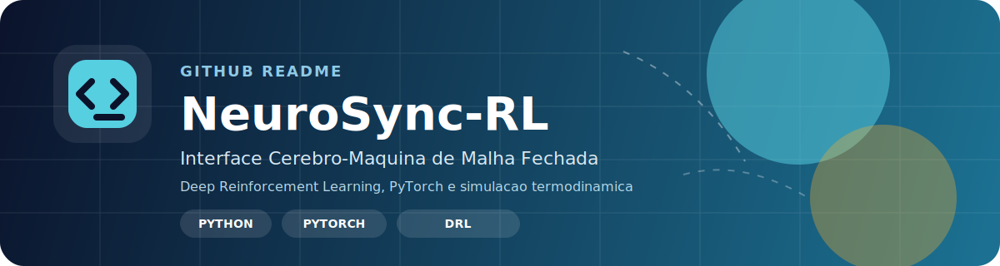

  

  
  
  
  
  <a href="https://github.com/gabriel-lab-ia/gabriel-lab-ia">
  

  
  
  
  
  
    
     
  
  

# Gabriel Duarte

**Bachelor's Student ~ Early-Career**  
**Machine Learning • Deep Learning • Reinforcement Learning • Robotics Simulation • Systems Based on Artificial Intelligence**

BSc in Artificial Intelligence (1st Semester). Engineering trajectory focused on Machine Learning, Data Analysis, Reinforcement Learning, physics simulation, and low-latency inference pipelines built on the GPUs ecosystem.

Work centered on control, optimization, and systems engineering, integrating TensorRT, CUDA, Isaac-based physics engines, and modern robotics frameworks.

## Core Technical Focus

### Machine Learning and Reinforcement Learning Engineering
- Machine Learning for data analysis and intelligent systems
- Reinforcement Learning engineering: PPO / SAC / TD3
- Real-time continuous-control evaluation
- Latency-oriented benchmarks: CPU vs CUDA vs TensorRT

### Model Export and Inference Optimization
- Policy export: PyTorch -> ONNX -> TensorRT FP16
- ONNX Runtime CUDA
- Low-latency inference design
- Real-time RL system execution
- Model compression and runtime optimization

### GPU and High-Performance Computing
- CUDA Toolkit 12.0 + CUDA Runtime 13
- PyTorch CUDA
- TensorRT 10: builder, engines, and FP16 optimization
- Parallel simulation and vectorized training workflows

### Simulation and Robotics
- NVIDIA Isaac Gym
- MuJoCo 3.5
- Control-loop engineering
- ROS2 (Jazzy)

## Academic Formation

**BSc in Artificial Intelligence — UniCEUB (Campus Asa Norte)**  
**Current semester:** 1st semester

Formal academic curriculum providing foundational competencies in mathematics, computation, algorithms, software engineering, data systems, cybersecurity, cloud, machine learning, and artificial intelligence.

This degree provides the theoretical and computational base for AI systems, while my Independent Engineering Track covers advanced Reinforcement Learning, GPU systems, simulation, robotics, optimization, and deployment engineering beyond the curriculum.

## Academic Curriculum

- Semester 1: Conversational Agents, Linear Algebra and Analytic Geometry, Bootcamp I, Software Engineering, Programming Logic, Probability and Statistics
- Semester 2: Calculus for Computing, Cloud Computing, Ethical Dialogues and Reflections, Cybersecurity Fundamentals, Foundations of Artificial Intelligence
- Semester 3: Machine Learning, Database Systems, NoSQL Systems, Bootcamp II, Advanced Calculus for Computing, AI Development I, Digital Signal Processing for AI
- Semester 4: Systems Analysis and Design, Deep Learning, AI Development II, AI Data Structures, Project Management, Artificial Neural Networks
- Semester 5: Algorithm Analysis and Design, Bootcamp III, AI Entrepreneurship, Natural Language Processing, Integrative Project I, Computer Vision
- Semester 6: Unsupervised Learning, High-Performance Computing (HPC), MLOps, Elective I, Integrative Project II
- Semester 7: Bootcamp IV, Generative Artificial Intelligence, Elective II, Integrative Project III, Special Topics in Artificial Intelligence

## Formal Academic Baseline

This academic track establishes the formal baseline in the following areas:

- Mathematics for AI: algebra, calculus, probability, and optimization
- Software engineering and computational thinking
- Data systems and distributed computation
- Machine Learning fundamentals
- Neural networks and Deep Learning
- Cybersecurity and cloud systems
- High-Performance Computing and MLOps
- NLP and Computer Vision
- Capstone projects and applied AI design

## Dual-Track Development

Combined with my independent engineering development in Reinforcement Learning, Isaac Gym, CUDA 13, TensorRT, MuJoCo, ROS2, low-latency control, and GPU systems, this forms a dual-track training approach: one academic and one technically aggressive, industry-aligned track.

## Technical Roadmap During the University Period

- Mathematics for RL: linear algebra, optimization, and probability
- CUDA runtime behavior, profiling, and memory models
- TensorRT optimization workflows
- Isaac Gym fundamentals
- ROS2 operational basics
- Advanced continuous control
- Massive GPU-parallel simulation with Isaac Gym
- Distributed training pipelines
- Navigation and manipulation in ROS2 environments
- Custom CUDA kernels
- Specialized physics simulators
- EdgeAI deployment on Jetson Orin
- TensorRT + Triton end-to-end pipelines
- Large-scale RL infrastructure
- Low-latency robotic control systems
- Full-stack kinematic and deployment architectures
- End-to-end optimization of models and simulators
